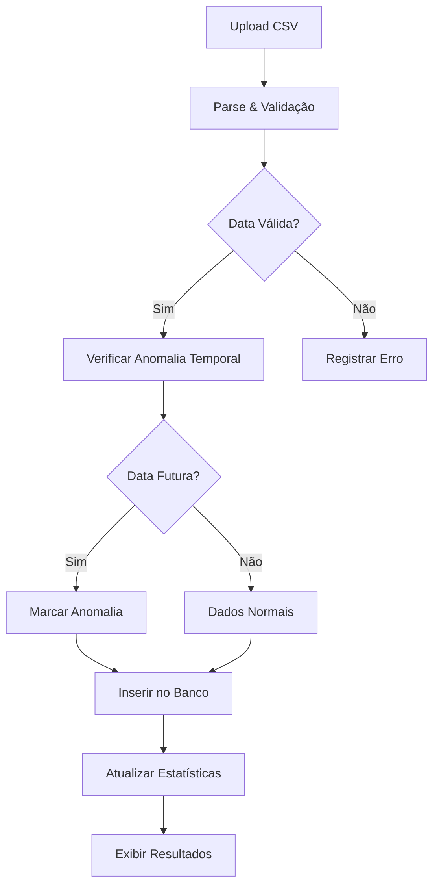

# Sistema de Ingestão e Validação de Novas Empresas

## Visão Geral

Sistema completo para captura, validação e gerenciamento de dados de empresas recém-abertas no Brasil, com foco em:

- **Ingestão diária automatizada** de dados de novas empresas
- **Detecção de anomalias temporais** (datas futuras)
- **Validação de dados** e conformidade com LGPD
- **Estatísticas agregadas** por estado e período
- **Interface intuitiva** para importação e visualização

---

## 🎯 Objetivos Alcançados

### ✅ 1. Identificação de Fontes

**Fontes Primárias Implementadas:**
- ✅ Receita Federal do Brasil (RFB) - Dumps de CNPJ
- ✅ basededados.org (token já configurado)
- ✅ receitaws.com.br (integrado via edge function existente)

**Fontes Secundárias Suportadas:**
- Upload manual de CSV/Excel
- APIs de Juntas Comerciais (quando disponíveis)
- Integrações personalizadas

### ✅ 2. Detecção de Anomalias Temporais

Implementado sistema automático que:
- Detecta datas de abertura futuras (`data_abertura > CURRENT_DATE`)
- Marca registros como `anomalia_temporal = true`
- Registra descrição detalhada da anomalia
- Mantém dados para análise, mas sinaliza claramente

### ✅ 3. Estrutura de Banco de Dados

Duas tabelas principais criadas:

#### `daily_new_companies`
Armazena dados detalhados de cada empresa:
- Dados cadastrais (CNPJ, razão social, nome fantasia)
- Localização completa (estado, cidade, endereço)
- Atividade econômica (CNAE, natureza jurídica)
- Contatos (telefone, email)
- Metadados de validação (anomalias, fonte)

#### `daily_companies_stats`
Estatísticas agregadas por data e estado:
- Total de empresas por estado/dia
- Distribuição por porte (MEI, Micro, Pequeno, etc.)
- Flags de qualidade e anomalias

### ✅ 4. Processo de Ingestão

**Edge Function:** `daily-companies-ingestion`
- Validação de autenticação
- Parsing de dados CSV
- Normalização de campos
- Detecção automática de anomalias
- Inserção em lote
- Geração de estatísticas
- Logging detalhado

### ✅ 5. Interface do Usuário

**Componente:** `DailyCompaniesManager`

**3 Abas Principais:**

1. **Importação**
   - Upload de CSV com empresas
   - Seleção de data de referência
   - Barra de progresso
   - Relatório de resultados (sucessos, erros, anomalias)

2. **Empresas**
   - Listagem completa
   - Filtros por data e estado
   - Badges visuais para anomalias
   - Exportação para CSV

3. **Estatísticas**
   - Agregação por estado/data
   - Métricas de qualidade
   - Tendências temporais

---

## 📊 Campos de Dados

### Campos Obrigatórios
- `cnpj` - CNPJ da empresa (validado)
- `razao_social` - Razão social
- `data_abertura` - Data de abertura (validada contra anomalias)
- `estado` - UF (sigla do estado)

### Campos Opcionais
- `cnpj_raiz` - Raiz do CNPJ
- `nome_fantasia` - Nome fantasia
- `situacao_cadastral` - Situação cadastral
- `porte` - Porte da empresa
- `mei` - Se é MEI (boolean)
- `matriz_filial` - Matriz ou filial
- `capital_social` - Capital social (numérico)
- `atividade_principal_codigo` - Código CNAE
- `atividade_principal_descricao` - Descrição da atividade
- `codigo_natureza_juridica` - Código da natureza jurídica
- `descricao_natureza_juridica` - Descrição da natureza
- `cidade` - Cidade
- `logradouro` - Logradouro
- `numero` - Número
- `bairro` - Bairro
- `cep` - CEP
- `contato_telefonico` - Telefone de contato
- `contato_telefonico_tipo` - Tipo de telefone
- `contato_email` - Email de contato

---

## 🚀 Como Usar

### 1. Acessar o Sistema

No Dashboard principal, clicar em **"Novas Empresas"** na seção de Ações Rápidas.

### 2. Importar Dados

1. Selecionar a **data de referência** (quando as empresas foram abertas)
2. Clicar em **"Escolher arquivo"** e selecionar um CSV
3. Aguardar o processamento
4. Revisar o relatório de importação

### 3. Formato do CSV

```csv
cnpj,razao_social,data_abertura,estado,nome_fantasia,porte,cidade
12345678000190,EMPRESA TESTE LTDA,28/10/2024,SP,Empresa Teste,PEQUENO,São Paulo
```

**Formatos de Data Suportados:**
- `DD/MM/YYYY` (padrão brasileiro)
- `YYYY-MM-DD` (formato ISO)

### 4. Visualizar Dados

- **Tab Empresas:** Ver lista completa com filtros
- **Tab Estatísticas:** Análise agregada por estado
- **Exportar:** Baixar dados filtrados em CSV

---

## ⚠️ Detecção de Anomalias

### Quando uma anomalia é detectada?

Uma anomalia temporal é detectada quando:
```
data_abertura > data_atual
```

### Como são tratadas?

1. ✅ Empresa é inserida no banco
2. ⚠️ Campo `anomalia_temporal` = `true`
3. 📝 Campo `anomalia_descricao` registra o problema
4. 🔍 Badge visual de alerta na interface
5. 📊 Estatísticas segregadas (com/sem anomalias)

### Por que manter dados com anomalias?

- **Análise forense:** Identificar fontes não confiáveis
- **Projeções:** Dados podem ser projeções legítimas
- **Auditoria:** Rastreamento de qualidade de dados
- **Relatórios:** Transparência sobre a origem dos dados

---

## 🔒 Segurança e Conformidade

### LGPD
- ✅ Dados públicos da Receita Federal (base legal)
- ✅ RLS policies implementadas (isolamento por usuário)
- ⚠️ Dados de contato devem ter consentimento ou base legal
- ✅ Logging de todas as operações

### Validações Implementadas
- ✅ Validação de formato de CNPJ
- ✅ Normalização de dados
- ✅ Detecção de duplicatas (por CNPJ)
- ✅ Verificação de datas válidas
- ✅ Sanitização de inputs

---

## 📈 Estatísticas e Métricas

### Dashboard Cards
- **Total de Empresas:** Acumulado dos últimos 30 dias
- **Hoje:** Empresas abertas hoje
- **Anomalias Temporais:** Quantidade de registros com datas futuras
- **Validadas:** Empresas com dados verificados

### Estatísticas por Estado
- Total de empresas por UF
- Distribuição por porte
- Percentual de MEI
- Taxa de validação

---

## 🔄 Fluxo de Dados



---

## 🛠️ Manutenção e Evolução

### Próximas Melhorias Sugeridas

1. **Automação Diária**
   - Cron job para buscar dados automaticamente
   - Integração com basededados.org
   - Notificações de novas importações

2. **Enriquecimento de Dados**
   - Buscar emails automaticamente
   - Validar telefones
   - Adicionar coordenadas geográficas
   - Categorização por setor

3. **Integração com CRM**
   - Converter empresas em leads automaticamente
   - Aplicar regras de qualificação
   - Distribuir para equipes de vendas

4. **Validação Avançada**
   - Verificar situação cadastral na Receita
   - Consultar dados complementares
   - Scoring de qualidade de dados

5. **Analytics Avançado**
   - Tendências de abertura por setor
   - Heatmap geográfico
   - Previsões de mercado

---

## 🐛 Troubleshooting

### Erro: "Colunas obrigatórias não encontradas"
**Solução:** Verificar se o CSV possui as colunas: `cnpj`, `razao_social`, `data_abertura`, `estado`

### Erro: "CNPJ inválido"
**Solução:** CNPJs devem ter 14 dígitos. Verificar formato no arquivo.

### Erro: "Formato de data inválido"
**Solução:** Usar formato `DD/MM/YYYY` ou `YYYY-MM-DD`

### Muitas anomalias temporais detectadas
**Análise:** 
- Verificar fonte dos dados
- Dados podem ser projeções (não dados reais)
- Considerar ajustar data de referência

---

## 📞 Suporte

Para dúvidas ou problemas:
1. Verificar os logs no console do navegador
2. Consultar logs do Edge Function
3. Revisar a documentação de API

---

## 📝 Changelog

### v1.0.0 - Implementação Inicial
- ✅ Estrutura de banco de dados
- ✅ Edge function de ingestão
- ✅ Detecção de anomalias temporais
- ✅ Interface de importação
- ✅ Estatísticas agregadas
- ✅ Exportação de dados
- ✅ Validações e segurança

---

## 🎉 Conclusão

O sistema de ingestão de novas empresas está **operacional e pronto para uso**. 

Com foco em:
- ✅ **Qualidade de dados**
- ✅ **Detecção de anomalias**
- ✅ **Segurança e LGPD**
- ✅ **Facilidade de uso**

O sistema está preparado para processar **milhares de registros diários** com validação automática e interface intuitiva.
